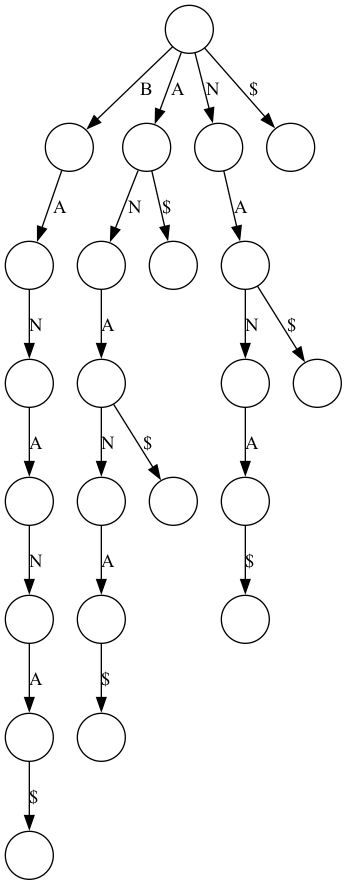

[](https://classroom.github.com/a/2H4hMYgM)
# suffix_index
Suffix data structures for aligning reads to a reference.

# Suffix Tree

## `add_suffix(nodes, suf)`

### Purpose
The `add_suffix` function integrates a suffix `suf` into an existing tree structure represented by nodes. This function modifies the nodes structure in-place by either adding a new node for the suffix if it's not already present, or by splitting an existing node in case only a part of the suffix matches.

### Parameters
- `nodes`: A list of nodes representing the current state of the suffix tree. Each node is a list containing two elements:
  1.  A substring (`SUB`) representing the edge label leading from the parent to the current node. The root node will have the empty string (`''`) as its edge label
  2.  A dictionary (`CHILDREN`) mapping the first character in the child's edge label to node indices representing the node's children.
- `suf`: A string representing the suffix to be added to the suffix tree.

### Operation
- The function iterates over the characters of `suf`.
- For each character, it checks if the character is already represented in the tree at the current node's children.
- If not, a new node is created for the remaining part of `suf`, and the process terminates for this suffix.
- If the character is found, the function compares the suffix with the substring of the found node to check how much of it matches.
- If a mismatch is found before the end of the node's substring, a new intermediate node is created to represent the common prefix, and the original node is split into two parts: the common prefix and the remaining substring.
- This process is repeated until the entire suffix has been processed.

### Notes

- This function is called iteratively by `build_suffix_tree for each` suffix of the input text.
- The constants `CHILDREN` and `SUB` are assumed predefined indices or keys that correspond to the children dictionary and the substring part of a node, respectively. 

## `build_suffix_tree(text)`

### Purpose

The `build_suffix_tree` function constructs a suffix tree for a given input string text. It initializes the tree structure and iteratively adds each suffix of text to the tree using the add_suffix function.

### Parameters

- `text`: The input string for which the suffix tree is to be constructed.

### Returns

A list of nodes representing the suffix tree of the input text. Each node is structured as described in the `add_suffix` function documentation.

### Operation

- Appends a terminal symbol `$` to the end of text to mark the end of the string. This ensures that all suffixes are considered unique.
- Initializes the tree with a single root node having an empty substring and no children.
- Iterates over each index of `text`, treating each suffix starting from that index as a new suffix to be added to the tree.
- Calls `add_suffix` for each of these suffixes, passing the current state of the tree and the suffix.
- Returns the constructed suffix tree.

### Notes

- The suffix tree structure allows for efficient search and analysis operations on the input text, such as finding substrings, repetitions, etc.
- The terminal symbol $ is crucial for ensuring that no suffix is a prefix of another, simplifying the tree construction logic.

## Suffix Trie

The suffix trie is a straightforward data structure suffix structure. It honestly kind of sucks.

### `build_suffix_trie(s, show_progress=False)`

#### Purpose  
The `build_suffix_trie` function constructs a suffix trie for the given input string `s`. Each node of the trie is represented as a dictionary that maps characters to their child nodes.

#### Parameters  
- `s`: The input string for which to construct the suffix trie.
- `show_progress` (optional): Boolean flag to indicate if progress should be shown via `tqdm` (default: `False`).

#### Returns  
A nested dictionary structure (`root`) representing the suffix trie.

#### Operation  
- Appends a terminal symbol `$` to ensure all suffixes are unique.
- Iterates over all suffixes, progressively building a nested dictionary structure.
- Optionally shows construction progress using the `tqdm` library.

## Suffix Array

The suffix array is a compact and memory-efficient data structure that enables rapid substring search, crucial for efficient alignment of sequencing reads against reference genomes.

### `build_suffix_array(T)`

#### Purpose
Constructs a suffix array from the input string `T` by first building a suffix tree and then extracting sorted suffix indices.

#### Parameters
- `T`: The input string for which the suffix array is constructed.

#### Returns
A sorted list of integer indices representing the starting positions of suffixes of `T`, ordered lexicographically.

#### Operation
- Constructs a suffix tree from the given input string.
- Performs a breadth-first traversal (BFS) of the suffix tree to find leaf nodes, identifying each suffix's starting position.
- Collects and sorts the suffix positions based on the lexicographic order of suffixes.

## Dependencies
- Python 3
- matplotlib
- numpy
- psutil
- tqdm
- graphviz
- seaborn
- pandas
- os

## Experiments

My experiments consist of running the 'benchmark.py' script, which allow me to visualize the time and space complexities of the suffix tree, suffix trie, and suffix array data structures. The script generates plots showing the time taken to build each data structure and the memory usage during construction.

### To conduct them yourself

1. Clone the repository.
2. Go to the root of the repository.
3. Run the following command in the terminal:
```bash
python3 src/benchmark.py
```

### Extra:
If you want to build the suffix tree, suffix trie, and suffix array for a specific text, you can use the following code:
This will also generate a visualization of the data structure in the pngs folder.

```bash
python3 src/suffix_tree.py
--string BANANA \
--query BAN
```


```bash
python3 src/suffix_trie.py
```




If you are interested in how the suffix array is constructed and stored "visually", you can run the following code:
```bash
python3 src/suffix_array.py \
--string BANANA \
--query ANANA NANA ANA A NA BANANA$
```
and output like this will be sent to the txts/suffix_array folder.

```bash
Suffix Array for text: 'BANANA'
--------------------------------------------------
Index | Suffix Position | Suffix
--------------------------------------------------
    0 |              5 | A
    1 |              3 | ANA
    2 |              1 | ANANA
    3 |              0 | BANANA
    4 |              4 | NA
    5 |              2 | NANA
```

# Credits
- [Ben Langmead](https://github.com/BenLangmead) for some of the code in the suffix tree and suffix array files.
- [GeeksforGeeks](https://www.geeksforgeeks.org/ukkonens-suffix-tree-construction-part-6/?ref=lbp) for the implementation of Ukkonen's algorithm.
